# USAGE

## MPLABX

### Load Project

File -> Open Project

Select

`./MPLABX/firmware/ATMEL_SAM_D21_Dev.X`

## MPLAB® Harmony Configurator v3

### Load settings

### Launch MHC

Tools -> Embedded -> MPLAB@ Harmony 3 Configurator

Harmony 3 Configuratorが正しく読み込まれていれば, 以下のような画面が現れる.

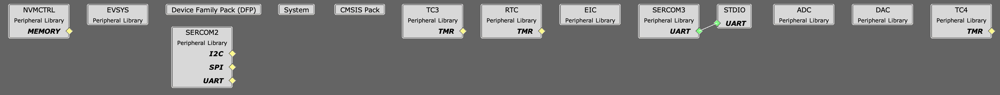

### Close MHC

MHC -> Exit

## Generate Code

MHC -> Generate Code

## MHC Settings

### System Settings

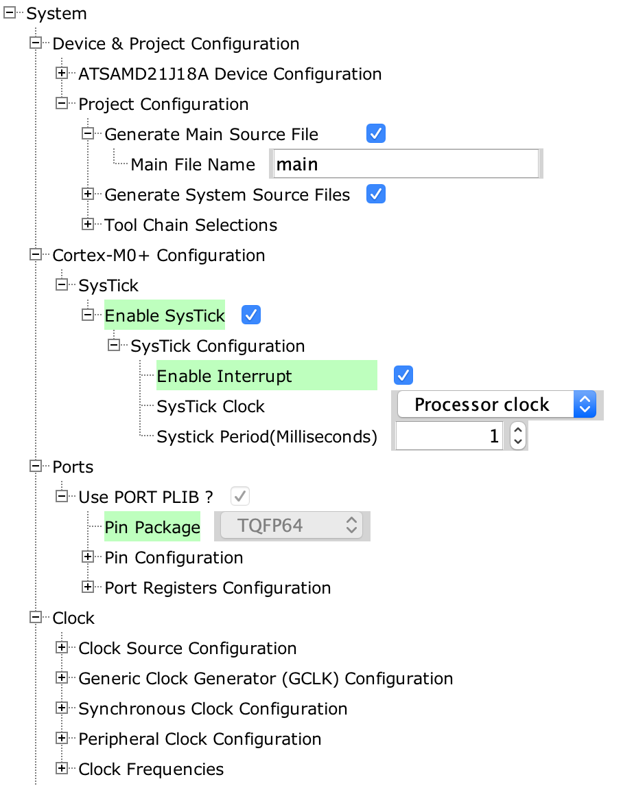

Ports -> Use PORT PLIBをTQFP64に変更する.(Pin Tableからも変更可能.) パッケージの変更を行うとピンの設定が初期化されるので初めに行うことをおすすめする.

Processor clockを使ってdelay(SYSTICK_DelayMs)を使用する場合はSysTickの設定をする.

コード生成の設定などもSystemに集約されているので一度全体に目を通しておくことをおすすめする.

### Clock Settings

クロックの設定を行う.

MHC -> Tools -> Clock Configuration

基本的には初期設定のまま.

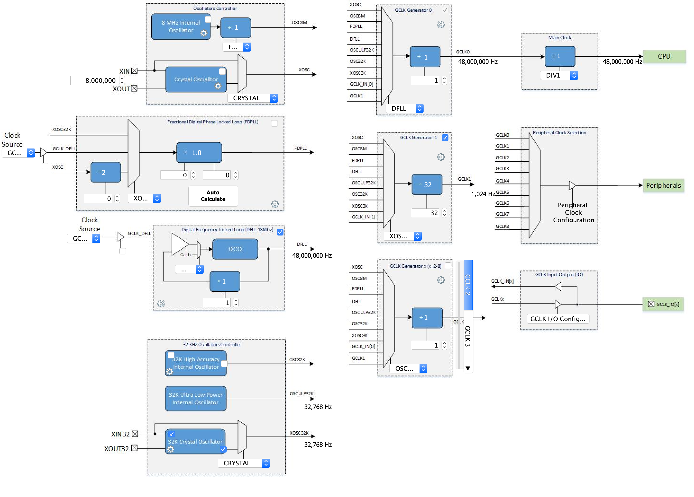

水晶を用いてRTCを使用する場合は以下の設定をする. 外部CRYSTALを使うように設定.

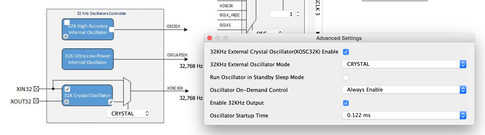

GCLK1を外部CRYSTALを32分周したものに設定.

RTCのクロックソースをGCLK1に設定.

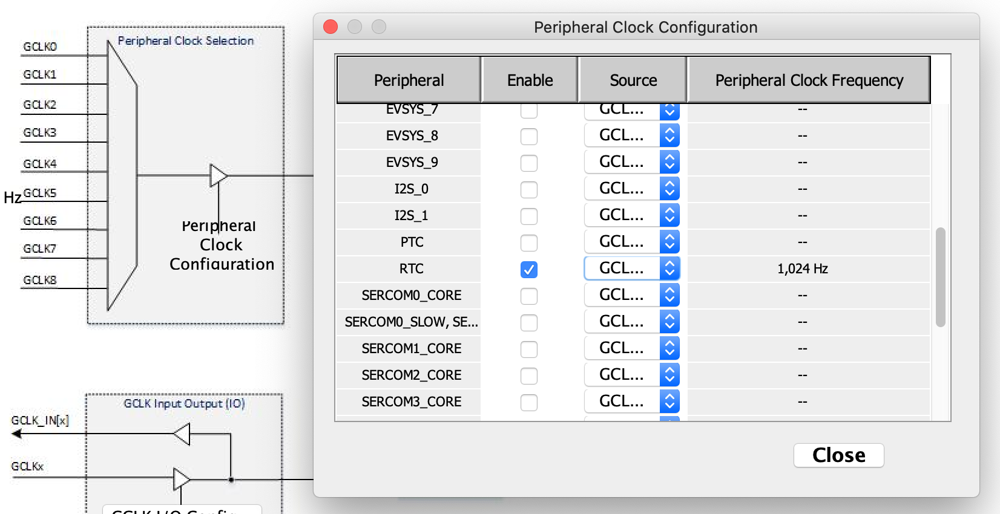

### DMA Settings

DMAの設定を行う.

MHC -> Tools -> DMA Configuration

SERCOM3をUSARTとして使用する場合は以下の設定をする.

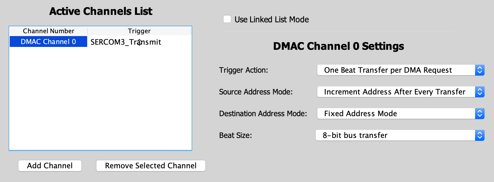

### NVIC Settings

割り込みの設定を行う.

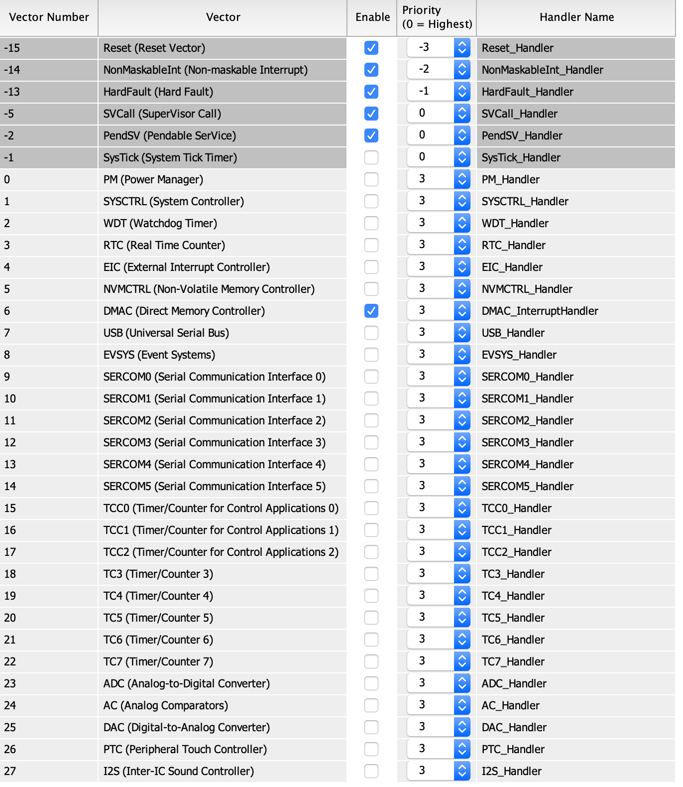

割り込みの優先順位を一括で管理する.

### Pin Settings

ピンの設定を行う.

MHC -> MHC -> Pin Configuration

以下のピン設定を行う. 設定を変更するピンのみ記載. (-：設定不可)

|No.|Pin ID|Custom Name    |Function       |Mode    |Direction|Latch|Pull Up|Pull Down|Drive Strength|
|:--|:--   |:--            |:--            |:--     |:--      |:--  |:--    |:--      |:--           |
|3  |PA02  |               |DAC_VOUT       |Analog  |-        |-    |-      |-        |-             |
|11 |PB08  |               |TC4_WO0        |Digital |-        |-    |-      |-        |-             |
|12 |PB09  |               |TC4_WO1        |Digital |-        |-    |-      |-        |-             |
|17 |PA08  |               |SERCOM2_PAD0   |Digital |-        |-    |-      |-        |-             |
|18 |PA09  |               |SERCOM2_PAD1   |Digital |-        |-    |-      |-        |-             |
|19 |PA10  |               |ADC_AIN18      |Analog  |-        |-    |-      |-        |-             |
|32 |PA15  |               |EIC_EXTINT15   |-       |-        |-    |Enable |-        |-             |
|43 |PA22  |               |SERCOM3_PAD0   |Digital |-        |-    |-      |-        |-             |
|44 |PA23  |               |SERCOM3_PAD1   |Digital |-        |-    |-      |-        |-             |
|59 |PB30  |LED            |GPIO           |-       |Out      |-    |-      |-        |-             |

設定後のピンの状態.

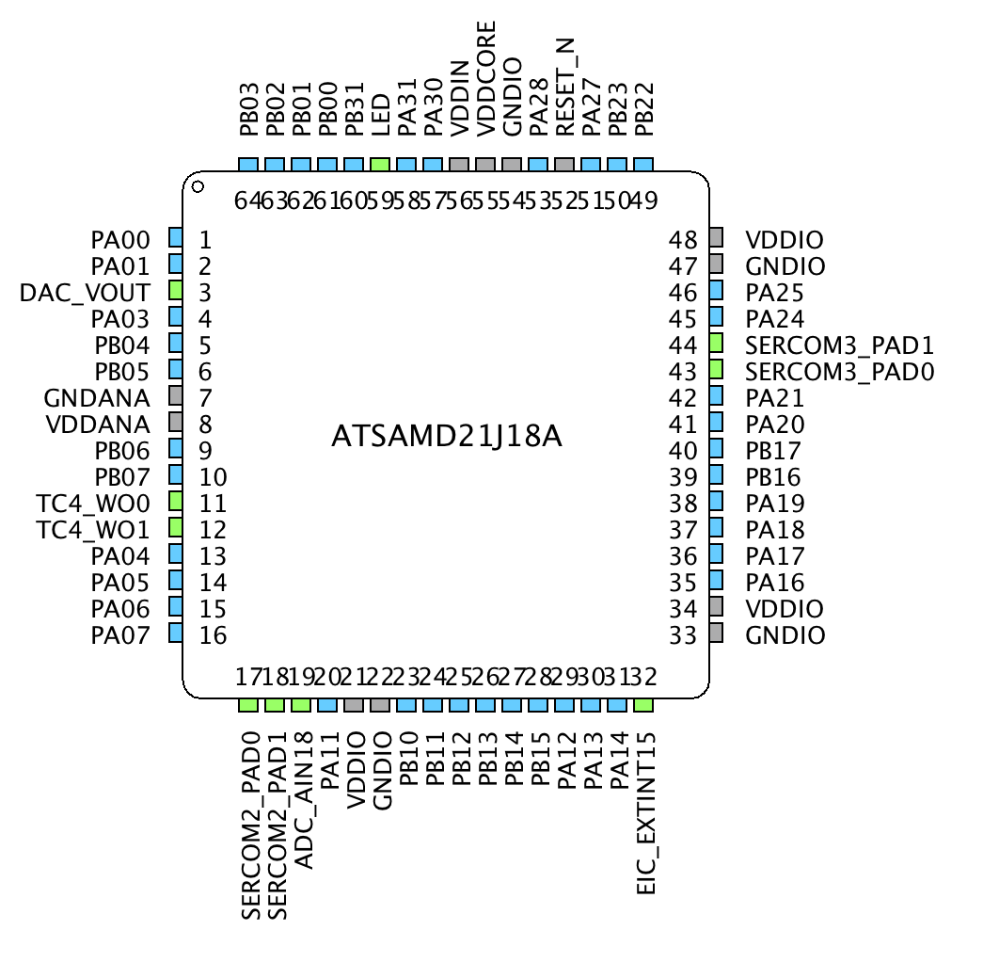

## Main

MHC3でコード生成されるmainファイルをNo.0とする. 以降, 機能を追加していくたびにmainファイルを別で生成する.

デバッグの際は, mainファイルを切り替えて使用する. 基本的には上から順に動作確認することを前提とする.

|No.|Program File                                                |Description                      |
|:--|:--                                                         |:--                              |
|0  |[main.c](MPLABX/firmware/src/main.c)                        |default                          |
|1  |[main_gpio.c](MPLABX/firmware/src/main_gpio.c)              |Digital Out, Digital In          |
|2  |[main_delay.c](MPLABX/firmware/src/main_delay.c)            |Delay Function                   |
|3  |[main_timer.c](MPLABX/firmware/src/main_timer.c)            |Timer Function(on TC3)           |
|4  |[main_rtc.c](MPLABX/firmware/src/main_rtc.c)                |Real Time Clock Function         |
|5  |[main_eic.c](MPLABX/firmware/src/main_eic.c)                |External Interrupt Function      |
|6  |[main_usart.c](MPLABX/firmware/src/main_usart.c)            |USART(on SERCOM3)                |
|7  |[main_stdio.c](MPLABX/firmware/src/main_stdio.c)            |Stnadard IO Function             |
|8  |[main_adc.c](MPLABX/firmware/src/main_adc.c)                |ADC Function                     |
|9  |[main_dac.c](MPLABX/firmware/src/main_dac.c)                |DAC Function                     |
|10 |[main_pwm.c](MPLABX/firmware/src/main_pwm.c)                |PWM Function(on TC4)             |
|11 |[main_iic_LM75BD.c](MPLABX/firmware/src/main_iic_LM75BD.c)  |I2C Master LM75BD(on SERCOM2)    |

## Peripheral Settings

### 1 GPIO

基板のUSER BUTTONを押すと, USER LEDが点灯するサンプル.

PA15の設定のみ変更し, コード生成を行う. 初期では状態変化割り込みとしているが汎用の入力ピンに変更するため.

|No.|Pin ID|Custom Name    |Function       |Mode    |Direction|Latch|Pull Up|Pull Down|Drive Strength|
|:--|:--   |:--            |:--            |:--     |:--      |:--  |:--    |:--      |:--           |
|32 |PA15  |BUTTON         |GPIO           |-       |In       |-    |-      |-        |-             |

他のサンプルを試す場合は元に戻す.

### 2 Delay

Systickを利用したDelay関数で100msのタイマーを作成し, LEDをToggleさせる.

### 3 Timer

Available Components -> Periherals -> TC -> TC3を選択.

TC3を利用した100msのタイマーを作成し, LEDをToggleさせる.

TC3を以下のように設定する.

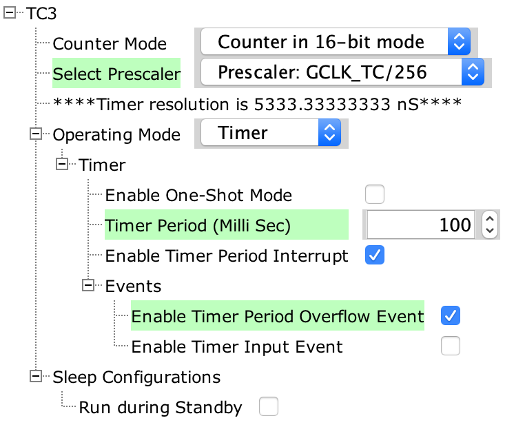

### 4 RTC

Available Components -> Periherals -> TC -> RTCを選択.

RTCを利用した1sのタイマーを作成し, LEDをToggleさせる.

RTCを以下のように設定する.

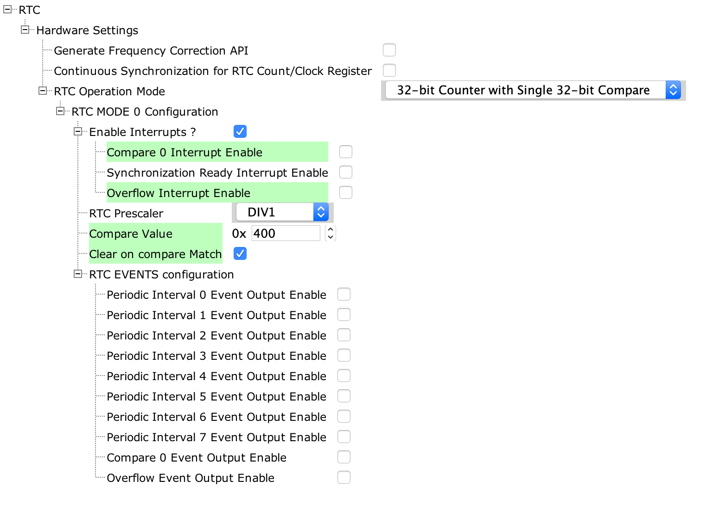

### 5 EIC

Available Components -> Periherals -> EIC -> EICを選択.

状態変化割り込みでボタンの変化を読み取る.

EICを以下のように設定する.

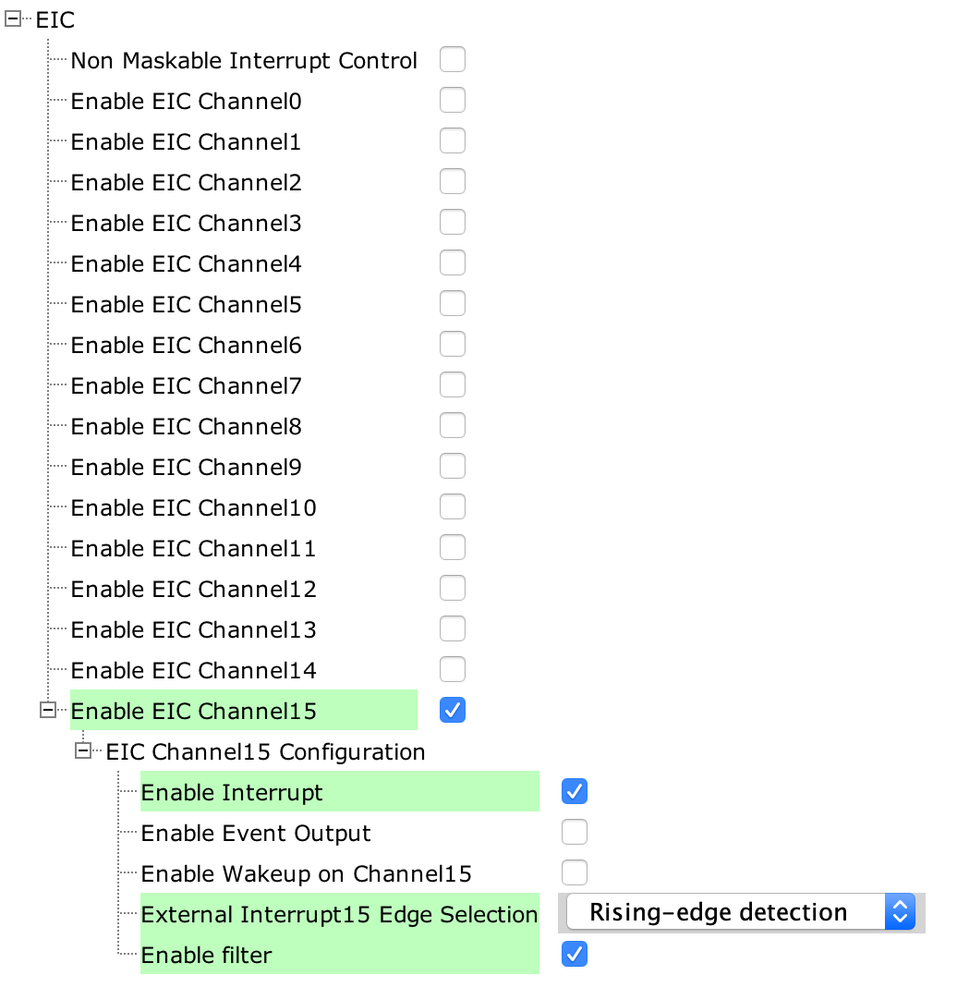

### 6 SERCOM UART

Available Components -> Periherals -> SERCOM -> SERCOM3を選択.

SERCOM3をUSARTに設定し, TermianlでSerialデバッグをする.

SERCOM3を以下のように設定する.

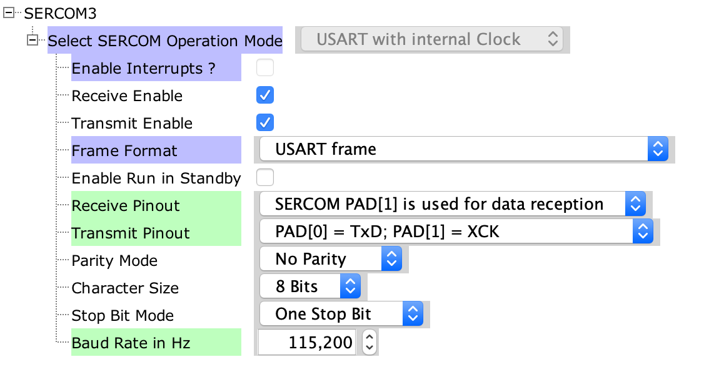

Terminalで確認する.

### 7 SERCOM printf

Available Components -> Tools-> STDIOを選択.

printfのputc, getcをSERCOM3にリダイレクトするように設定する.

SERCOM3とSTDIOのUARTピンをそれぞれ接続する.

### 8 ADC

Available Components -> Periherals -> ADC -> ADCを選択.

MHC -> MHC -> ADC Configurationを選択.

PA10をADC入力(AIN18)として使用する.

ADC Configurationを以下のように設定する.

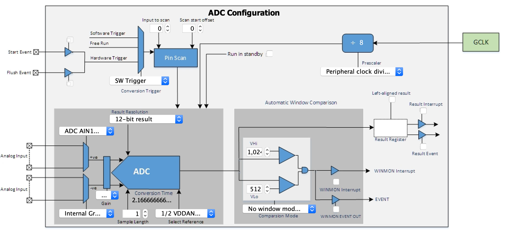

ADCを以下のように設定する.

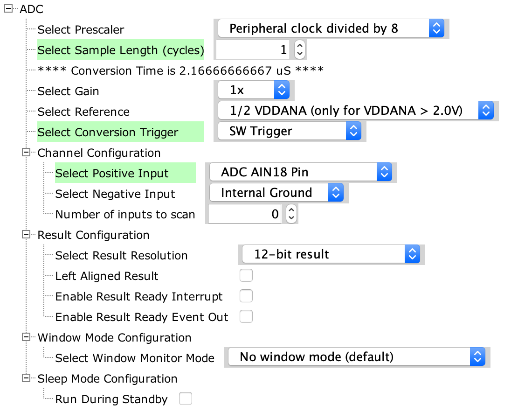

Terminalで確認する.

### 9 DAC

Available Components -> Periherals -> DAC -> DACを選択.

DACを以下のように設定する.

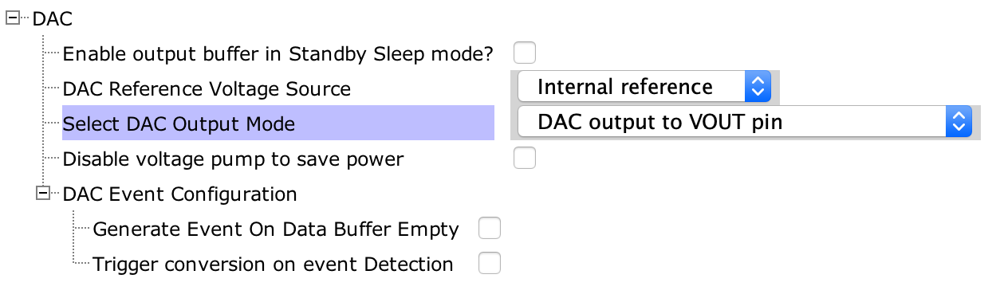

### 10 PWM

Available Components -> Periherals -> TC -> TC4を選択.

TC4を以下のように設定する. PWM周波数：1kHz, 初期Duty：50%に設定.

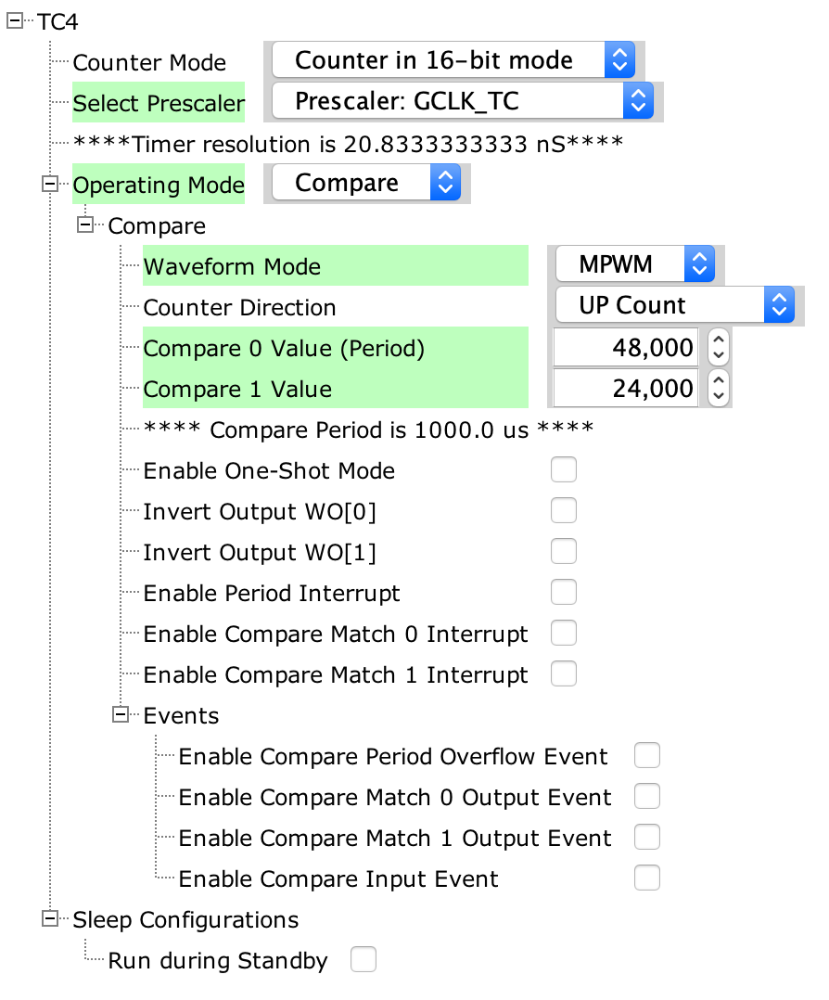

### 11 I2C Master LM75BD

Available Components -> Periherals -> SERCOM2を選択.

SERCOM2を以下のように設定する.

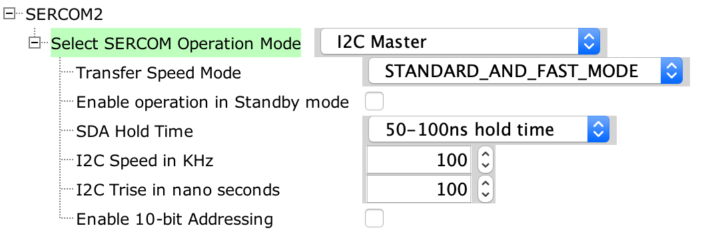

温度センサー[LM75BD](https://www.nxp.com/docs/en/data-sheet/LM75B.pdf)から温度を取得する.

回路は以下と同等である.

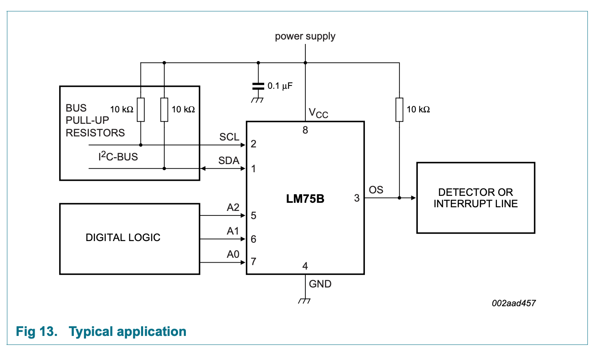

スレーブアドレスは下記のように設定可能. ソースでは, A0:1, A1:1, A2:1とする.

Slave Address Table

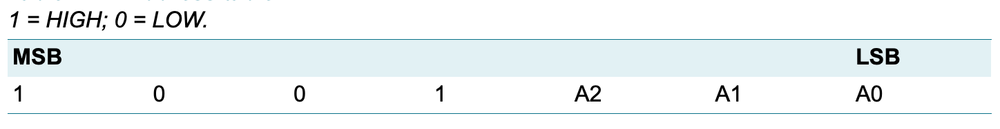

また, Registerを下記に示す. 温度は, Address:0x00から始まる2byteのデータを取得する.

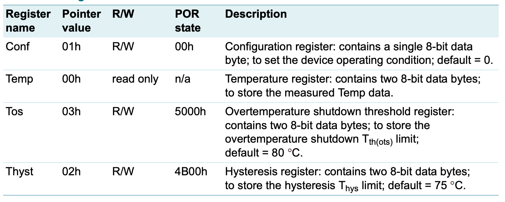

